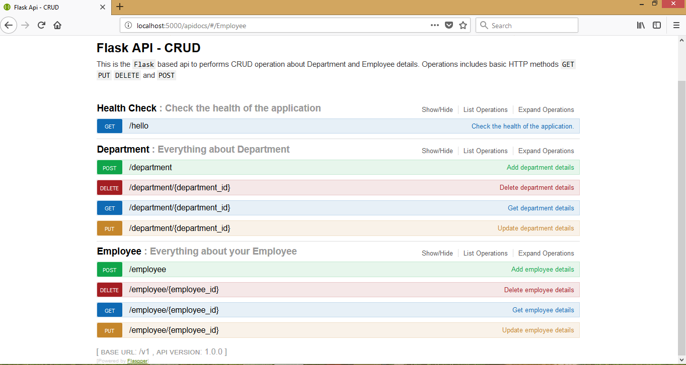

# Swagger Specification

Swagger specifications for **CRUD** operation of *Department* and *Employee*.
Specification included for basic HTTP methods **GET**, **PUT**, **DELETE** and **POST**

Access swagger UI through following url, 
Run api and hit *http://localhost:5000/apidocs* url on browser.

The above UI shows all available api endpoints. Following actions can performs using this interface,
  * Endpoints metadata are available such as headers, url parameters, request body, http responses etc.
  * Facility to execute endpoints on the fly.

**Reference Link:** 
[Swagger Tool](https://swagger.io/)
